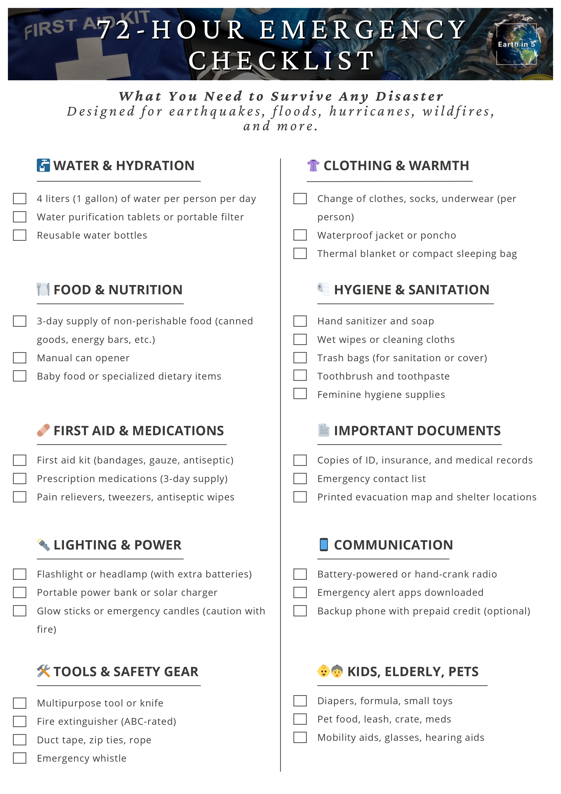
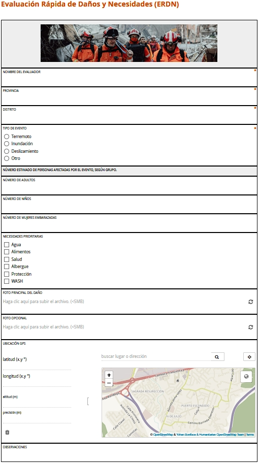

# 🛠️ Disaster Readiness Suite

This repository contains an integrated solution for disaster preparedness, designed for individuals, field teams, and humanitarian organizations. It includes:

- 📘 An educational disaster guidebook.
- ✅ A 72-hour emergency kit checklist.
- 📋 A KoboToolbox-based Rapid Damage and Needs Assessment (ERDN) form.

---

## 📂 What's Included?

### 1. 📘 Disaster Guidebook

A visual and informative guide focused on natural hazards, their effects, and how to respond. It is designed to educate communities and decision-makers in Latin America and beyond.

<table>
<tr>
<td>

**Includes:**

- Introduction to Natural Disasters
- Types of Hazards (Floods, Earthquakes, Landslides, etc.)
- Prevention and Preparedness
- Community Recommendations
- Visual Diagrams and Examples

</td>
<td>

</td>
</tr>
</table>

📘[Disaster Guide](./documents/disaster_guide.pdf)

---

### 2. ✅ 72-Hour Emergency Kit Checklist

A practical and printable checklist for preparing a personal or family emergency kit. Ideal for households, shelters, and community leaders.

<table>
<tr>
<td>

**Includes:**

- Water and Food Supplies
- First Aid and Hygiene
- Documents and Emergency Contacts
- Tools and Flashlights
- Infant and Elderly Needs

</td>
<td>

</td>
</tr>
</table>

✅[72 Hour Checklist](./documents/emergency_checklist_72h.pdf)

---

### 3. 📋 KoboToolbox Form: Rapid Damage and Needs Assessment (ERDN)

An advanced mobile survey form created using KoboToolbox. This tool is used in disaster zones for collecting real-time data to support humanitarian response.

<table>
<tr>
<td>

**Features:**

- Cascading selections: Province → District
- Multilingual support (Spanish/English)
- Logic-based question flows
- Media integration (images in questions)
- Strict data validation

</td>
<td>

</td>
</tr>
</table>

🔗 Live Example: [ERDN Form](https://ee.kobotoolbox.org/x/HeEAT9eF/)

---

## 🚀 How to Use the KoboToolbox Form

1. Open your KoboToolbox account.
2. Upload the XLSForm (`kobotoolbox_form/ERDN_form.xlsx`).
3. Upload all media from `kobotoolbox_form/media/`.
4. Deploy the form and share the survey link with data collectors.

---

## 📌 About This Project

This initiative was developed by Tamir Chong as part of his efforts to promote preparedness and effective disaster response through accessible tools and public education.

- 📍 Based in Panama
- 🔗 [LinkedIn Profile](https://www.linkedin.com/in/tamirchong/)

---

## 📄 Licenses

- El código y los formularios de KoboToolbox están licenciados bajo la [Licencia MIT](./LICENSE).
- El libro **"Guía de Desastres Naturales"** y el **Checklist de Emergencia 72h** están licenciados bajo [CC BY-NC-ND 4.0](./documents/LICENSE_BOOK_CHECKLIST.md).
